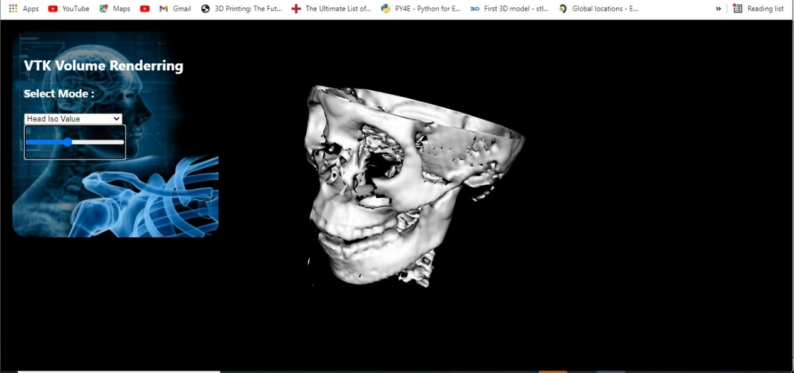
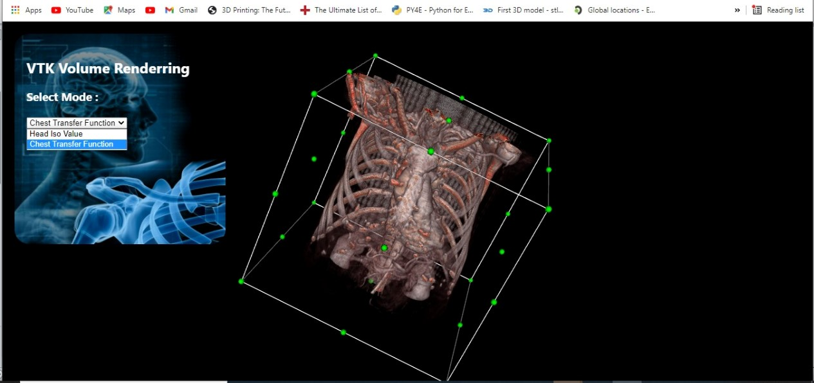
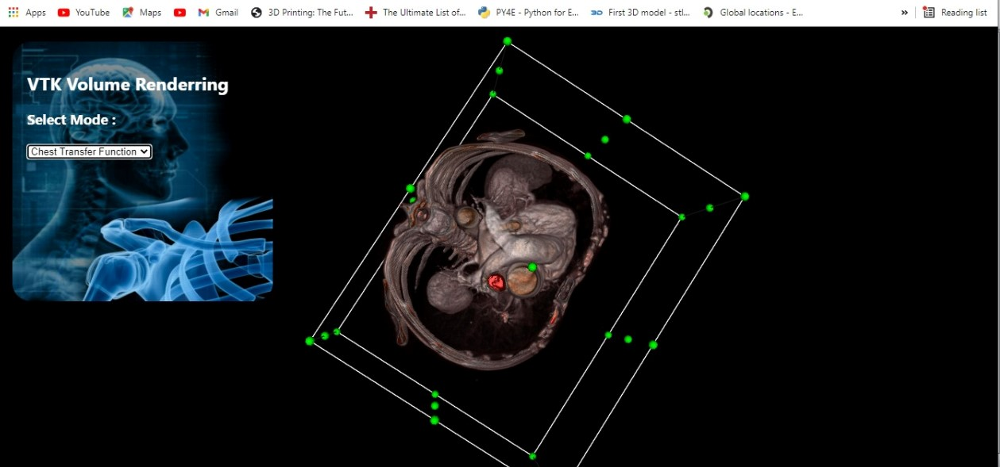
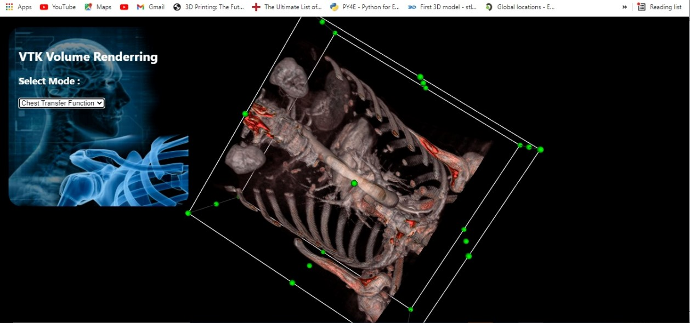

# Computer Graphics Final Projct (VTK.js) Report

## Students:

- Anas Mohamed Fawzy - Sec.(1) - B.N.(16)
- Omar Ahmed Mansour - Sec.(2) - B.N.(1)
- Muhammad Ahmad AbdAl-Alim AbdAl-Aziz - Sec.(2) - B.N.(10)
- Mohamed Mansour El-Sabbagh - Sec.(2) - B.N.(20)

## Introduction:

In this project we used VTK.js & HTML with React to build a web page that displays two views independently:

- Surface Rendering:

  In this model we used an example from vtk.js which shows a head with variable ISO value that can be controlled through a slider.

    

- Ray Casting Rendering:

  This model we used an example from vtk.js to display an 3D view of CT scan for human chest, this view can be cropped by the user using a widget.

     
     
     

## Code Sequence:

The core of this project is in the _headchest ()_ function, this function uses a flag value to toggle between the two views ( 0 for head view and 1 for chest view ).
Before the flag value is checked we define the main menue, renderer, and the reader.

```javascript
function headchest (){
    const fullScreenRenderer = vtkFullScreenRenderWindow.newInstance({
        background: [0, 0, 0],
    });
    const renderer = fullScreenRenderer.getRenderer();
    const renderWindow = fullScreenRenderer.getRenderWindow();
    const reader = vtkHttpDataSetReader.newInstance({ fetchGzip: true });
```

Then, Flag value is checked through if condition. Some code blocks from head example are inserted in the if block

```javaScript
function headchest (){
 if (flag==0){
     const marchingCube = vtkImageMarchingCubes.newInstance({
       contourValue: 0.0,
       computeNormals: true,
       mergePoints: true,
     });
     // and code continues............................
```

and other code blocks from chest example are inserted in the else block where we added our static color transfare function and piecewise fnction for oppacity.

```javascript
function headchest (){
  else{
      const apiRenderWindow = fullScreenRenderer.getApiSpecificRenderWindow();
      global.renderer = renderer;
      global.renderWindow = renderWindow;
      // and code continues............................
```

## Problem Faced:

It was difficult to understand example codes and vtk.js library system in order to be able to edit and customize the code.
We overcome this problem by searching and applying try and error technique.
